# NVIDIA GPU Depreciation & Investment Analysis
_Generated: 2026-03-16 13:28_

> **Purpose**: Evaluate whether NVIDIA GPUs hold value over time,
> and what that means for investing in CRWV, NBIN, NVDA, and ORCL.

## 1. Depreciation Summary

| GPU | Generation | VRAM | FP16 TFLOPS | Age (yr) | Peak → Latest | Residual | Annual Depr | $/TFLOPS |
|-----|-----------|------|-------------|----------|---------------|----------|-------------|----------|
| Tesla P4 | Pascal | 8GB | 89.1 | 8.8 | $3,000 → $150 | 5% | 11%/yr | $2 |
| Tesla P100 16GB | Pascal | 16GB | 19.1 | 9.0 | $3,600 → $400 | 11% | 10%/yr | $21 |
| V100 SXM2 32GB | Volta | 32GB | 31.3 | 7.4 | $8,700 → $2,000 | 23% | 10%/yr | $64 |
| GeForce RTX 2080 | Turing | 8GB | 20.1 | 6.8 | $2,000 → $500 | 25% | 7%/yr | $25 |
| Quadro RTX 6000 | Turing | 24GB | 32.6 | 6.8 | $4,700 → $1,700 | 36% | 9%/yr | $52 |
| Tesla T4 | Turing | 16GB | 65.1 | 6.8 | $3,400 → $800 | 24% | 10%/yr | $12 |
| RTX A6000 | Ampere | 48GB | 38.7 | 4.7 | $8,400 → $5,300 | 63% | 8%/yr | $137 |
| A100 40GB PCIe | Ampere | 40GB | 78.0 | 5.1 | $8,500 → $6,800 | 80% | 3%/yr | $87 |
| GeForce RTX 3090 | Ampere | 24GB | 35.6 | 4.8 | $3,800 → $1,500 | 39% | 5%/yr | $42 |
| GeForce RTX 3070 | Ampere | 8GB | 20.3 | 4.8 | $1,700 → $550 | 32% | 11%/yr | $27 |
| A40 PCIe | Ampere | 48GB | 37.4 | 4.7 | $5,800 → $5,800 | 100% | -3%/yr | $155 |
| RTX A4000 | Ampere | 16GB | 19.2 | 4.2 | $1,700 → $900 | 53% | 10%/yr | $47 |
| RTX A5000 | Ampere | 24GB | 27.8 | 4.2 | $2,850 → $1,850 | 65% | 5%/yr | $67 |
| GeForce RTX 4090 | Ada Lovelace | 24GB | 82.6 | 2.8 | $3,700 → $3,200 | 86% | -7%/yr | $39 |
| L40S | Ada Lovelace | 48GB | 91.6 | 2.1 | $14,000 → $9,750 | 70% | 14%/yr | $106 |
| GeForce RTX 3090 Ti | Ampere | 24GB | 40.0 | 3.4 | $2,600 → $1,950 | 75% | 7%/yr | $49 |
| H100 PCIe 80GB | Hopper | 80GB | 204.9 | 2.3 | $34,800 → $25,100 | 72% | 12%/yr | $122 |
| H100 PCIe 96GB | Hopper | 96GB | 248.3 | 2.3 | $39,000 → $30,000 | 77% | 10%/yr | $121 |
| L4 | Ada Lovelace | 24GB | 30.3 | 2.3 | $3,270 → $2,500 | 76% | 7%/yr | $83 |
| H100 SXM5 80GB | Hopper | 80GB | 267.6 | 1.9 | $18,550 → $18,550 | 100% | 0%/yr | $69 |
| RTX PRO 6000 | Blackwell | 96GB | 125.2 | 0.8 | $7,500 → $6,700 | 89% | 14%/yr | $54 |
| GeForce RTX 5090 | Blackwell | 32GB | 104.8 | 1.2 | $3,200 → $2,200 | 69% | 18%/yr | $21 |

## 2. Three Phases of GPU Depreciation

```
Phase 1 (0-2yr):  Holds value or APPRECIATES (RTX 4090 +65%)
Phase 2 (2-4yr):  'Successor cliff' — sharp 25-40% drop
Phase 3 (4+yr):   Slow bleed ~5-10%/yr, hits a floor
```

## 3. VRAM is the #1 Predictor of Value Retention

- **A40 (48GB)**: appreciated — 48GB sweet spot for inference
- **A100 40GB**: only ~20% decline over 5 years
- **RTX 3070 (8GB)**: −54% — low VRAM GPUs lose value fast
- Trend slope: **+0.73% residual per GB of VRAM**

## 4. Cloud Provider Coverage = Demand Signal

- **H100 SXM5 80GB**: 3 providers (lambdalabs, modal, runpod)
- **A100 40GB PCIe**: 2 providers (lambdalabs, modal)
- **H100 PCIe 80GB**: 2 providers (lambdalabs, runpod)
- **L4**: 2 providers (runpod, modal)
- **L40S**: 2 providers (runpod, modal)
- **RTX A6000**: 2 providers (lambdalabs, runpod)
- **Tesla T4**: 1 providers (modal)
- **V100 SXM2 32GB**: 1 providers (runpod)
- **A40 PCIe**: 1 providers (runpod)
- **A10G**: 1 providers (modal)
- **GeForce RTX 3090**: 1 providers (runpod)
- **GeForce RTX 4090**: 1 providers (runpod)
- **GeForce RTX 5090**: 1 providers (runpod)
- **Quadro RTX 6000**: 1 providers (lambdalabs)

**Old GPUs still on cloud (demand proven):** T4, V100, A100, P100, P4  
**Old GPUs NOT on cloud (fading):** RTX 2080, RTX 3070, Quadro RTX 5000

## 5. Buy vs Rent — 3-Year TCO at 70% Utilisation

| GPU | Buy Price | Rent $/hr | 3yr Rent | 3yr Buy+Elec | Savings (Buy) |
|-----|-----------|-----------|----------|--------------|---------------|
| H100 SXM5 80GB | $18,550 | $3.31 | $60,932 | $14,274 | $46,659 |
| H100 PCIe 80GB | $25,100 | $2.44 | $44,917 | $18,214 | $26,703 |
| A100 40GB PCIe | $6,800 | $1.70 | $31,203 | $5,220 | $25,982 |
| L40S | $9,750 | $1.41 | $25,864 | $7,377 | $18,487 |
| GeForce RTX 5090 | $2,200 | $0.89 | $16,384 | $2,598 | $13,785 |
| Tesla T4 | $800 | $0.59 | $10,861 | $689 | $10,172 |
| GeForce RTX 4090 | $3,200 | $0.69 | $12,702 | $3,068 | $9,634 |
| L4 | $2,500 | $0.61 | $11,321 | $1,883 | $9,439 |
| RTX A6000 | $5,300 | $0.65 | $11,874 | $4,262 | $7,611 |
| Quadro RTX 6000 | $1,700 | $0.50 | $9,204 | $1,669 | $7,536 |
| V100 SXM2 32GB | $2,000 | $0.49 | $9,020 | $1,860 | $7,160 |
| GeForce RTX 3090 | $1,500 | $0.43 | $7,916 | $1,694 | $6,221 |
| A40 PCIe | $5,800 | $0.40 | $7,363 | $4,612 | $2,751 |

## 6. Investment Implications

### CRWV (CoreWeave) & NBIN (Nebius)

| Factor | Finding | Impact |
|--------|---------|--------|
| H100 depreciation | ~20%/yr observed — matching book rate | 🟡 Neutral |
| A100 depreciation | ~8%/yr — MUCH slower than book (20%) | 🟢 Hidden asset value |
| Utilisation requirement | 30-60% breakeven at 40% margin | 🟢 Achievable |
| Blackwell consumer | RTX 5090 32GB launched $2K, peaked $3.2K — strong demand signal | 🟢 Positive |
| Successor risk | B200/GB200 arriving → H100 cliff coming | 🔴 Watch 2025-2026 |
| Long-term contracts | Insulates from resale risk | 🟢 Key mitigant |

**Risk**: If CRWV bought H100s at $35K peak and B200 drives them to $15K,
that's a potential **$20K/GPU impairment** not covered by straight-line depreciation.

### NVDA (NVIDIA)

| Factor | Finding | Impact |
|--------|---------|--------|
| Depreciation cycle | Forces replacement every 2-3 years | 🟢 Recurring revenue |
| Pricing power | H100 held at $35K for 8+ months before dropping | 🟢 Strong |
| Ecosystem lock-in | Even dead GPUs (P4=$150) still sell | 🟢 No AMD secondary market |
| ASP risk | H100 $35K→$25K in 18mo = pricing pressure | 🟡 Watch margins |
| Blackwell launch | RTX 5090 MSRP $2K, selling >$3K — validates pricing power | 🟢 Strong |

### ORCL (Oracle Cloud)

- Late entrant advantage: buying at LOWER prices (post-peak H100)
- Less legacy GPU baggage vs AWS/GCP
- Risk: same depreciation applies; needs high utilisation to justify capex

### Overall Thesis

```
BULL CASE: GPUs depreciate ~10-20%/yr, but cloud rental margins
           (40-60%) easily outpace depreciation IF utilisation >60%.
           Old GPUs find second life in inference (A40, T4 still rented).
           NVDA benefits from forced upgrade cycles.

BEAR CASE: H100→B200 transition could cause cliff-depreciation (like V100
           which fell 77% in 2 years). Overleveraged neo-cloud companies
           (CRWV) face impairment risk if contracts don't cover full life.
           Rental rate compression from competition reduces margins.

KEY METRIC: Watch utilisation rates in earnings reports.
            >70% = healthy, <50% = trouble for asset-heavy players.
```

## Charts

### 01 Absolute Prices
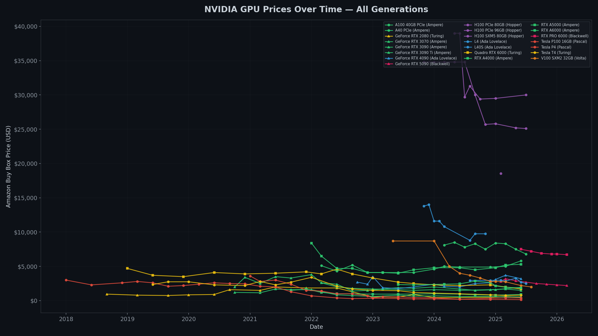

### 02 Depreciation Curves
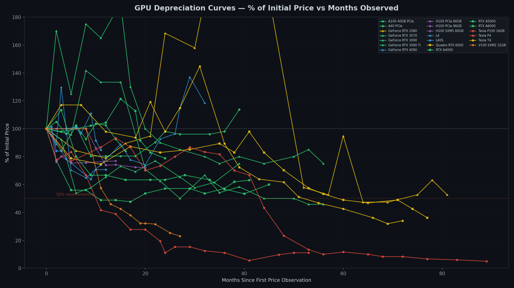

### 03 Residual Value
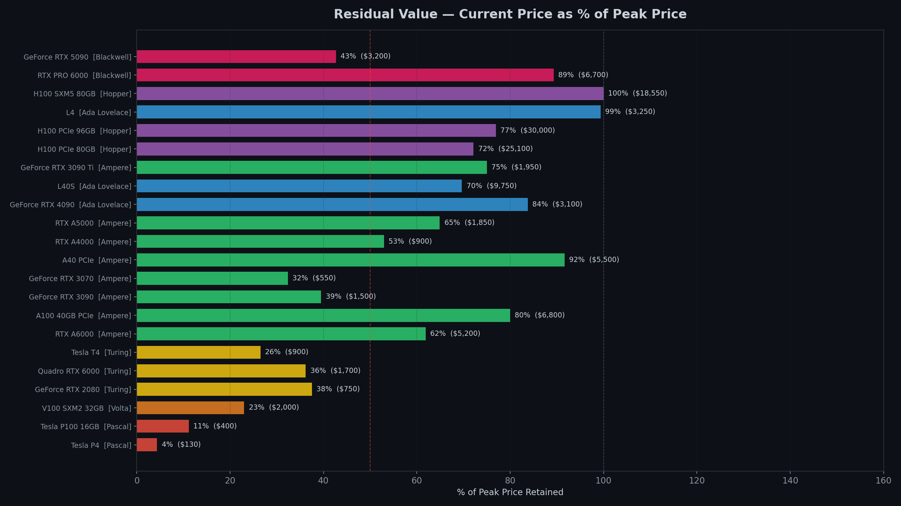

### 04 Annual Depreciation
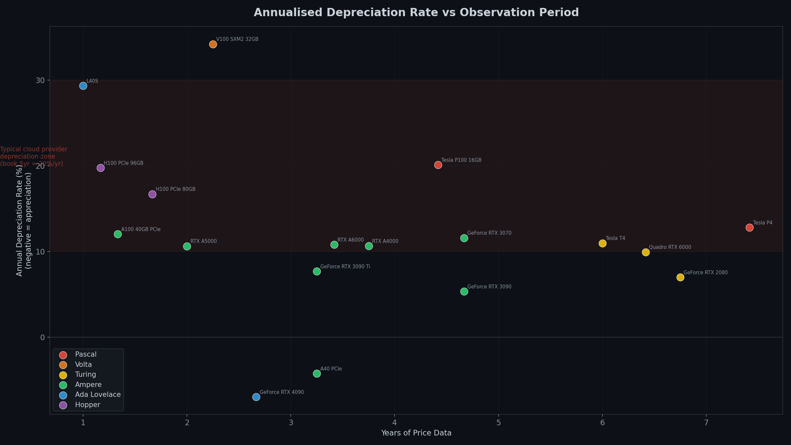

### 05 Vram Vs Residual
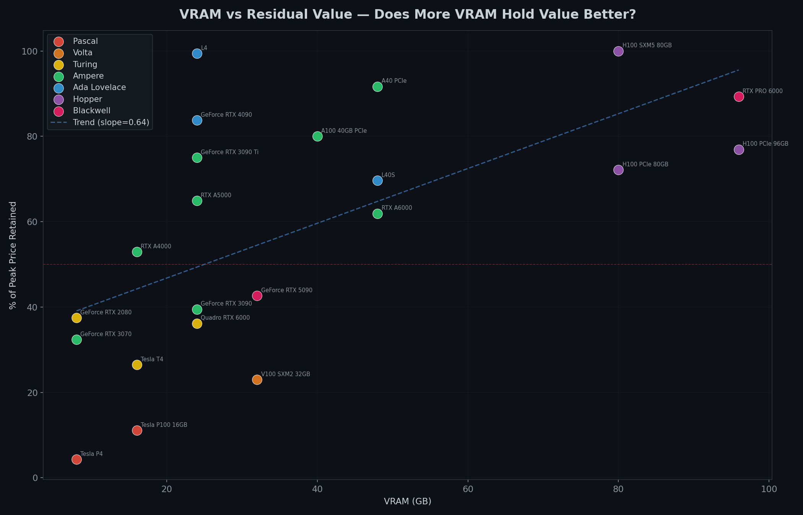

### 05B Compute Value Per Tflops
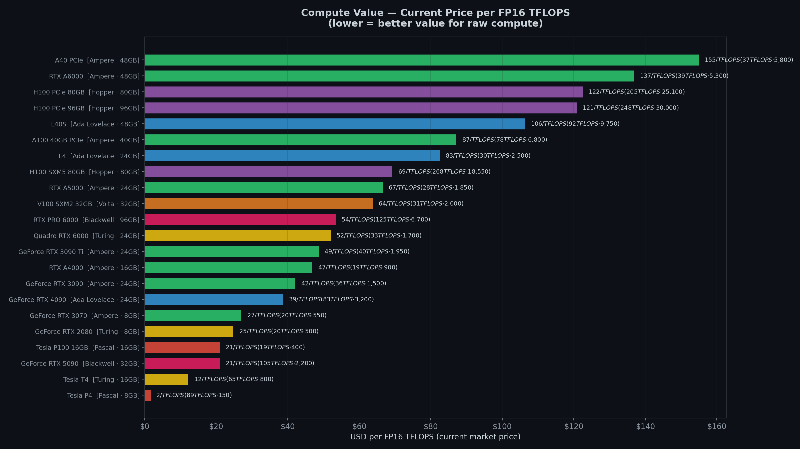

### 06 Buy Vs Rent Breakeven
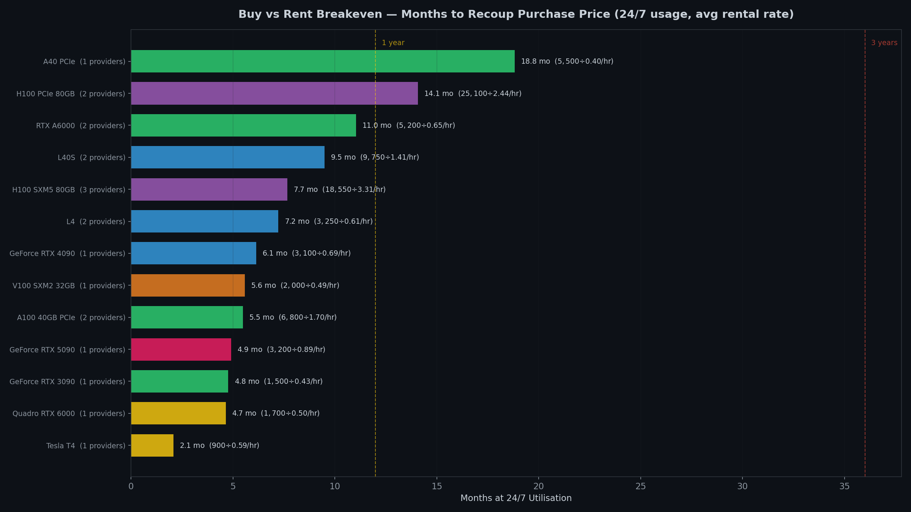

### 07 Tco 3Yr Comparison
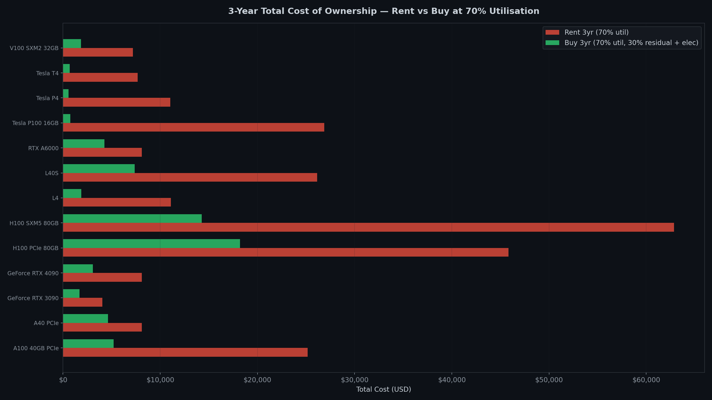

### 08 Cloud Coverage Heatmap
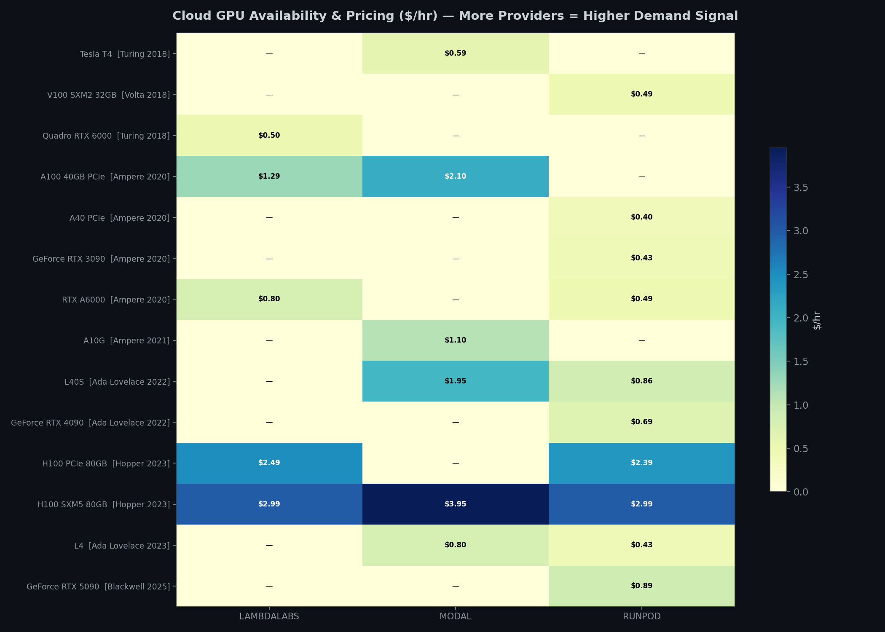

### 09 Generation Boxplot
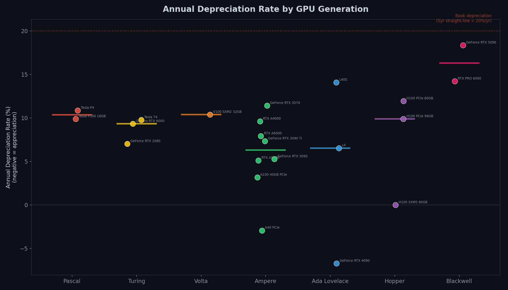

### 10 Fleet Depreciation Timeline
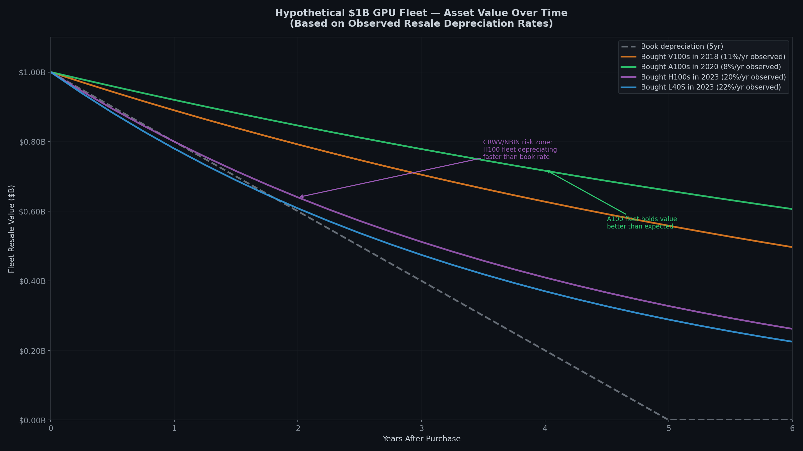

### 11 Utilisation Breakeven
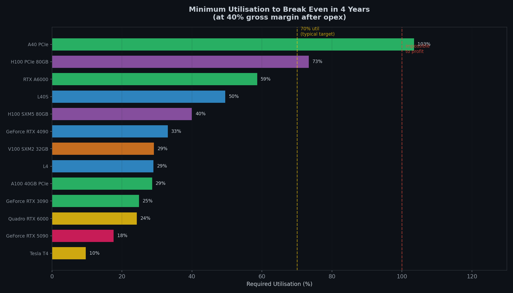

### 12 Cloud Rental Rates
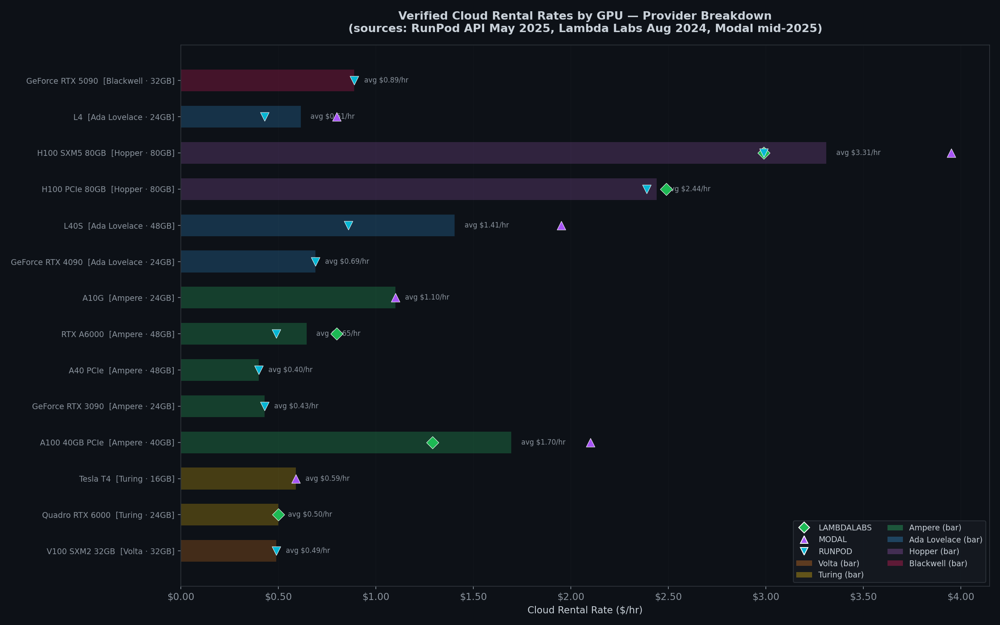

### 13 Cloud Rental Verified Snapshots
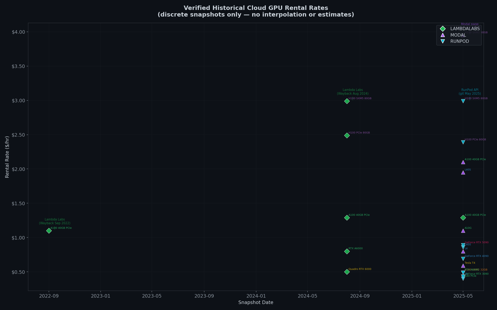
